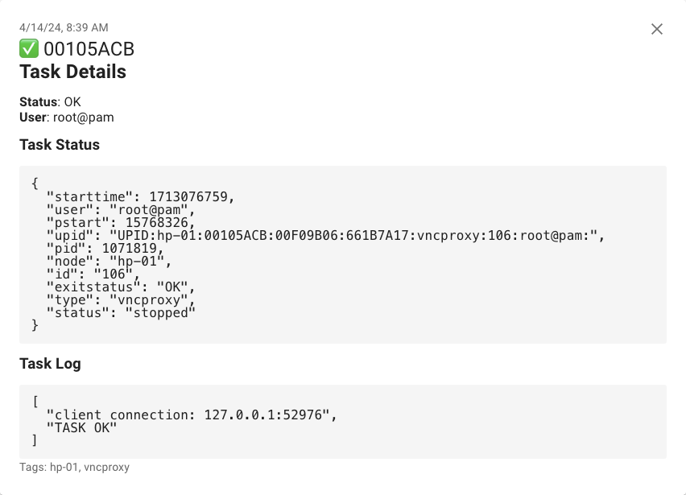

# Proxmox Ntfy



This project provides a Python script that monitors Proxmox tasks and sends notifications using the Ntfy service.

## Features

- Monitors Proxmox tasks in real-time
- Sends notifications with task status and log details
- Supports Markdown formatting in notifications
- Configurable using environment variables
- Lightweight Docker image based on python:alpine
- Gunicorn for running the script as a service

## Installation

Pull the Docker image from Docker Hub:

```sh
docker pull ibacalu/proxmox-ntfy
```

## Configuration

The script can be configured using the following environment variables:

- `NTFY_SERVER_URL`: Ntfy server URL and topic (default: "https://ntfy.sh/CA9FFE70-B1B0-4C1C-9256-0BBD8FAE2CE6")
- `NTFY_TOKEN`: Ntfy authentication token (optional)
- `NTFY_USER`: Ntfy username (optional)
- `NTFY_PASS`: Ntfy password (optional)
- `LOG_LEVEL`: Logging level (default: "INFO")
- `PROXMOX_API_URL`: Proxmox API URL (default: "pve:8006")
- `PROXMOX_USER`: Proxmox username (default: "root@pam")
- `PROXMOX_PASS`: Proxmox password (default: "root")

## Usage

Run the Docker container with the desired environment variables:

```sh
docker run -d --name proxmox-ntfy 
    -e NTFY_SERVER_URL="https://ntfy.sh" \
    -e PROXMOX_API_URL="your_proxmox_url" \
    -e PROXMOX_USER="your_username" \
    -e PROXMOX_PASS="your_password" \
ibacalu/proxmox-ntfy:latest
```

Alternatively, you can use Docker Compose to start the container:

```sh
docker-compose -f docker/compose.yml up -d
```

The script will start monitoring Proxmox tasks and send notifications to the configured Ntfy server.

## Contributing

Contributions are welcome! If you find any issues or have suggestions for improvements, please open an issue or submit a pull request.

## License

This project is licensed under the [GPL v3](LICENSE).
