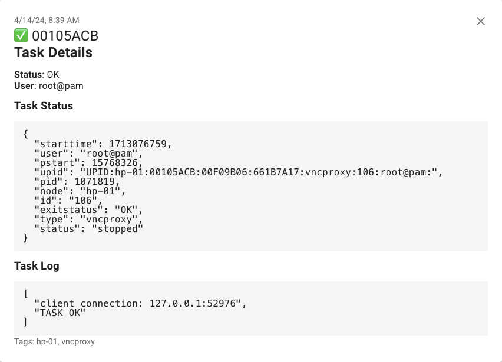

# Proxmox Ntfy



This project provides a Python script that monitors Proxmox tasks and sends notifications using the Ntfy service.

## Features

- Monitors Proxmox tasks in real-time
- Sends notifications with task status and log details
- Supports Markdown formatting in notifications
- Configurable using environment variables
- Lightweight Docker image based on python:alpine
- Gunicorn for running the script as a service

## Installation

Pull the Docker image from Docker Hub:

```sh
docker pull ibacalu/proxmox-ntfy
```

## Configuration

The script can be configured using the following environment variables:
(Hint: use/copy the provided `example.env` in the `docker` folder)

- `NTFY_SERVER_URL`: Ntfy server URL and topic  (mandatory)
- `NTFY_TOKEN`: Ntfy authentication token (optional)
- `NTFY_USER`: Ntfy username (optional)
- `NTFY_PASS`: Ntfy password (optional)
- `LOG_LEVEL`: Logging level (default: "INFO")
- `PROXMOX_API_URL`: Proxmox API URL (mandatory)
- `PROXMOX_PORT`: Port under which Proxmox is reachable, probably 8006, if you're connecting via IP. Set port 80 or 443, if Proxmox is behind a Reverse Proxy (mandatory)
- `VERIFY_SSL`: Whether proxmoxer should verify the SSL signature of the Proxmox host
- `PROXMOX_USER`: Proxmox username (mandatory)

If you want to use password authentication, set:
- `PROXMOX_PASS`: Proxmox password

If you want to use API Token authentication, set:
- `PROXMOX_TOKEN_NAME`: Token name set during creation, dont include the "root@pam"
- `PROXMOX_TOKEN_VALUE`: The secret that is displayed after creation

**Note:** If both password (`PROXMOX_PASS`) and token (`PROXMOX_TOKEN_NAME` + `PROXMOX_TOKEN_VALUE`) authentication methods are configured, token authentication takes precedence and the password will be ignored.

#### Generating a Proxmox API Token

To generate a Proxmox API token:

1. Log in to your Proxmox web interface
2. Select **"Datacenter"** from the left sidebar
3. Navigate to **"Permissions"** → **"API Tokens"**
4. Click **"Add"** to create a new token
5. Configure the token:
   - **User ID**: Select the user the token should be valid for (e.g., `root@pam`). This value is used as `PROXMOX_USER` in your configuration
   - **Token ID**: Give the token a name (e.g., `proxmox-ntfy`). This value is used as `PROXMOX_TOKEN_NAME` in your configuration
   - **Comment**: Optionally add a comment describing the token's purpose
   - **Expiration**: Optionally set an expiration date for the token
   - **Privilege Separation**: Either disable privilege separation or set permissions afterward accordingly.
6. Click **"Add"** to create the token
7. **Important**: Copy the **Secret** value immediately - this is only shown once and is used as `PROXMOX_TOKEN_VALUE` in your configuration
8. Update your `.env` file with the token details and test the configuration

### Required Permissions

When using API Token authentication, the token requires the following permissions:

- **Sys.Audit** permission on the datacenter level (`/`) or node level (`/nodes/{node_name}`)
  - This permission allows reading system audit logs and task information
  - If assigned at datacenter level, it applies to all nodes
  - If assigned at node level, only that specific node will be monitored

The application automatically checks permissions at startup and will:
- Monitor only nodes where the token has `Sys.Audit` permission
- Log warnings for nodes excluded due to insufficient permissions
- Fail to start if no nodes have the required permissions

**Note:** If you're using an API token with "Privilege Separation" enabled, ensure both the user and the token have the required permissions, as token permissions are the intersection of user and token permissions.

## Usage

Run the Docker container with the desired environment variables:

# Password authentication
```sh
docker run -d --name proxmox-ntfy 
    -e NTFY_SERVER_URL="https://ntfy.sh/your-topic" \
    -e PROXMOX_API_URL="your_proxmox_url" \
    -e PROXMOX_USER="your_username" \
    -e PROXMOX_PASS="your_password" \
ibacalu/proxmox-ntfy:latest
```

# API Token authentication
```sh
docker run -d --name proxmox-ntfy 
    -e NTFY_SERVER_URL="https://ntfy.sh/your-topic" \
    -e PROXMOX_API_URL="your_proxmox_url" \
    -e PROXMOX_USER="your_username" \
    -e PROXMOX_TOKEN_NAME="name_of_your_token" \
    -e PROXMOX_TOKEN_VALUE="secret_of_your_token" \
ibacalu/proxmox-ntfy:latest
```

Alternatively, you can use Docker Compose to start the container:

```sh
docker-compose -f docker/compose.yml up -d
```

The script will start monitoring Proxmox tasks and send notifications to the configured Ntfy server.

## Contributing

Contributions are welcome! If you find any issues or have suggestions for improvements, please open an issue or submit a pull request.

## License

This project is licensed under the [GPL v3](LICENSE).
